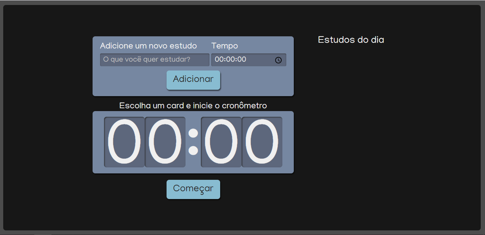
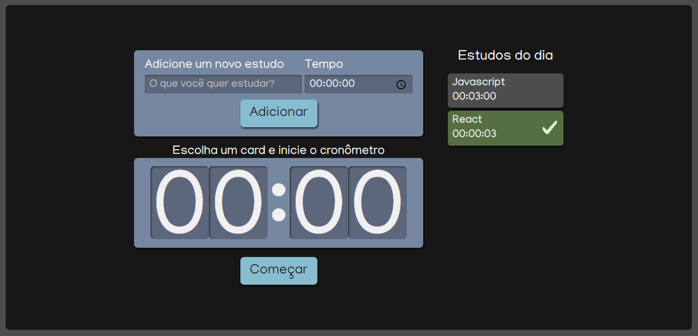

# Esse projeto foi feito em uma aula da Alura

## Demostração do projeto:

Cronômetro            | Tarefa e  Tarefa Concluída
:-------------------------:|:-------------------------:
 | 

### Principais tecnologias utilizadas:
<ul>
 <li>ReactJs;</li>
 <li>Typescript;</li>
 <li>Scss;</li>
 <li>Javascript;</li>
 </ul>
